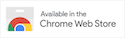
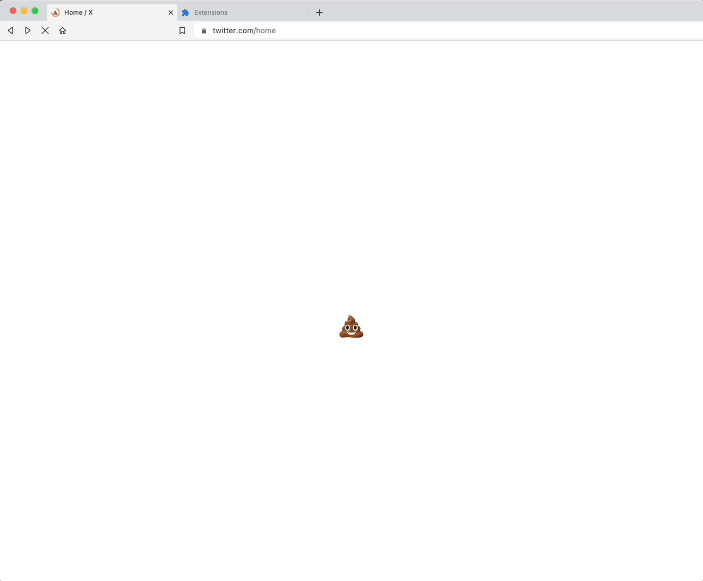

# X stands for

Alternative branding for Twitter / X It replaces the terrible new X icon with a poo emoji.

## How to install it

From _chrome://extensions/_ or _brave://extensions/_ select __load unpacked__ and select the folder containing this repository.

## In action

Inspired by [@cedmax](https://twitter.com/cedmax), dedicated to [elonmusk](https://twitter.com/elonmusk).
